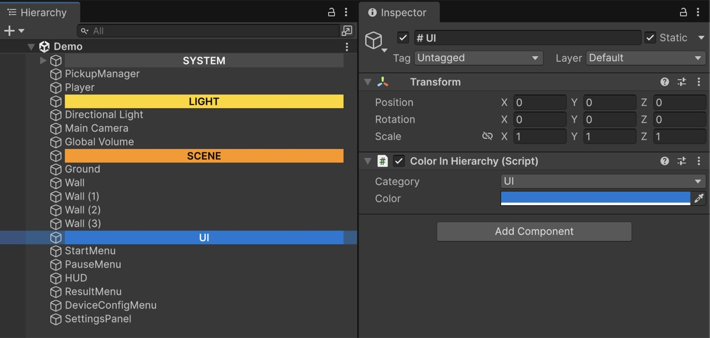
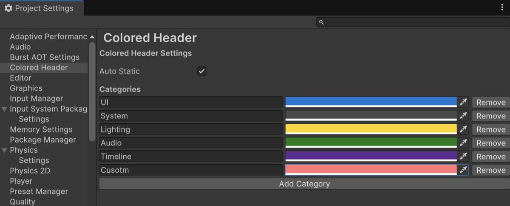

# ColoredHeader

A Unity package for color-coding objects in the Hierarchy view and organizing them as visually distinct headers.

## Features

- **ColorInHierarchy**: Adds a serializable color property to each GameObject, allowing individual customization of label colors in the Hierarchy.
- **Auto Header Formatting**: Automatically centers text in the Hierarchy for GameObjects whose names start with `#`, making them stand out as section dividers (headers).
- **Editor Extension**: Intuitive to use by simply adding a component, with no complex setup required.

## Installation

### Unity Package Manager (UPM)

1. Open `Window > Package Manager` in the Unity Editor.
2. Click the `+` button and select `Add package from git URL...`.
3. Enter the following URL and click `Add`:
   ```
   https://github.com/jnphgs/ColoredHeader.git#upm
   ```

## Usage



### 1. Changing Object Colors

1. Select the GameObject you want to color.
2. Add the `ColorInHierarchy` component.
3. Select a `Category` in the Inspector or set the `Color` property directly.
   - Setting a `Category` automatically applies a default color based on the intended use (UI, System, Lighting, Audio, Timeline, etc.).
   - To use a custom color, set `Category` to `None` and edit the `Color` directly.

### 2. Creating Headers

1. Create a GameObject to be used as a divider.
2. Prefix the object name with `#` (e.g., `# SYSTEM`).
3. The object's text will appear centered in the Hierarchy.



### 3. Project Settings

You can configure the package settings via `Project Settings > Colored Header`.

- **Auto Static**: Toggles whether to automatically set GameObjects to Static when the `ColorInHierarchy` component is attached.
- **Categories**: Manage and add categories that can be used with `ColorInHierarchy`.
  - **Add Category**: Click the "Add Category" button to add a new category and set its name and color freely.
  - **Remove Category**: Click the "Remove" button to delete a category.

## License

[MIT License](LICENSE)
